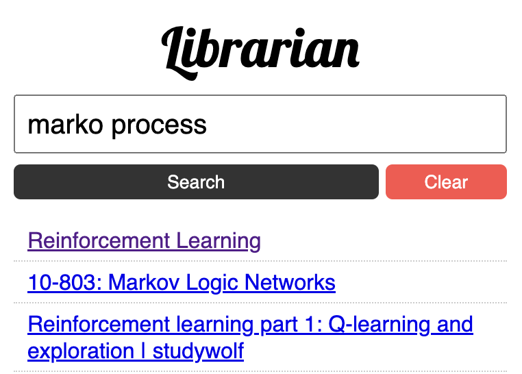

# Librarian

### Better Bookmark Search

Chrome extension to search your bookmarks' content right in your browser. Private and Fast. 

➤ Scrape content and embed using [Sentence-BERT](https://arxiv.org/abs/1908.10084) (through [transformer.js](https://github.com/xenova/transformers.js))\
➤ Store in localStorage\
➤ Vector search (with [orama](https://oramasearch.com/)).

WIP. Stay tuned for enhancements and fixes.